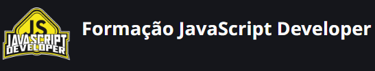

# DIO-Portfolio - (FORMAÇÃO JAVASCRIPT DEVELOPER)

 
 Projeto Digital Inovation One PARA A FORMAÇÃO de um Portfólio em nodes, html, css e javascript (Formação JavaScript Developer)Portfólio criado junto com o Bootcamp de JS da Digital Innovation One

<a href='https://joserenatofelix.github.io/js-developer-portfolio/'><button>Confira o projeto clicando aqui</button>

## Detalhes da formação
Aprenda JavaScript do zero, em uma abordagem de ensino totalmente imersiva e prática. Nesta formação você aprenderá desde os fundamentos desta linguagem de programação até o seu papel essencial na Web atualmente. Para isso, traremos uma dinâmica diferente de tudo o que você já viu, onde o expert conduz todo o primeiro módulo usando a técnica de "pair programming", ensinando o JavaScript do zero para um profissional em transição de carreira.

Nos dois módulos seguintes, você dominará os conceitos necessários para utilizar o JavaScript na Web, com ênfase no consumo de APIs, convenções e boas práticas. Por fim, para fechar a sua jornada com chave de ouro, você criará seu próprio currículo online com a identidade visual da DIO. Pré-requisitos: Nenhuma, mas Lógica de Programação e Pensamento Computacional são sempre bem-vindos. Boooora!? 👩‍💻👨‍💻

⚠️Pré-requisitos: Conhecimentos básicos em Lógica de Programação e Pensamento Computacional

✅Desejáveis: Formação HTML Developer e Formação CSS Developer

Atividades:
Desafio de Código: Coloque em prática todo o conhecimento adquirido nas aulas e teste o seu conhecimento na resolução de um desafio.

Desafio de Projeto: Construa o seu portfólio construindo projetos práticos com o conhecimento adquirido ao longo das aulas.

Ferramentas para o seu aprendizado:
Fórum: Espaço para você interagir e tirar suas dúvidas técnicas com a nossa comunidade.

Rooms: Espaço para você conversar com outros matriculados no bootcamp e aumentar o seu networking.

Matriculados: Saiba quem está participando da mesma jornada educacional que você.

Certificado: Baixe e compartilhe os certificados de todas as suas conquistas ao longo dessa formação.
